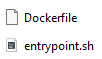
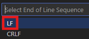
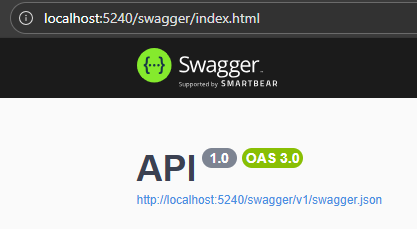

# Introduction

This document will guide you through the installation steps to start the PluginHost Service.

# Prerequisites

- Ensure that the application `Docker Desktop` is running.
- Follow the installation instructions to locally set up:
  - `Keycloak`
  - `MiniO`

# Technical Guide 

- There are two ways to set up this project. You only need to follow one of the setup options but you need access to the `Docker Image Hub` for both:
  - Click [here](#on-repository-access) on repository access when no docker compose files are provided.
  - Click [here](#on-image-access) when docker compose files are provided.

## On Repository Access

- Clone your project into a local folder.
- Make sure your project contains the latest version.
- Navigate to `_docker/`
- Open your command line interface within your current working directory. On Windows, you can use either the `Terminal` or `PowerShell` by right-clicking while holding the `Shift` key and selecting the option that corresponds to your command line interface.
- Execute the following command: `docker compose -p pluginhost-service -f docker-compose.yml -f docker‐compose-override.yml up -d`.

How it looks like, when `plugin-host-client` is not running:

If the `plugin-host-client` cannot run in docker, you must use the build mode. To use the build mode:

- Navigate to `Client/`.
  - The end line sequence of `Dockerfile` and `entrypoint.sh` must be `LF`.

  - You can change it by opening the files using `Visual Studio Code` and clicking on `CRLF` at the bottom right.

  - This will open a dropdown menu at the top where you can select the correct option: `LF`.

  - Make sure to save your changes.
  - You can close the files now.

- Again, navigate to `_docker/`
- Execute `docker compose -p pluginhost-service -f docker-compose.yml -f docker‐compose-override.yml build`.
- Then: `docker compose -p pluginhost-service -f docker-compose.yml -f docker‐compose-override.yml up -d`.

If you can access `localhost:5240/swagger` your PluginHost Service Server is now ready for use. 

And if you can access `localhost:5000` and you get redirected to `localhost:9345` your PluginHost Service Client is now ready for use. 

## On Image Access

To start the project, ensure you have three files in a single folder: `.env`, `docker-compose.yml`, and `docker-compose-override.yml`. It is not necessary to change the contents of these files for local setup.

- Open your command line interface within your current working directory. On Windows, you can use either the `Terminal` or `PowerShell` by right-clicking while holding the `Shift` key and selecting the option that corresponds to your command line interface.
- Execute the following command: `docker compose -p pluginhost-service -f docker-compose.yml -f docker‐compose-override.yml up -d`.

If you can access `localhost:5240/swagger` your PluginHost Service Server is now ready for use. 

And if you can access `localhost:5000` and you get redirected to `localhost:9345` your PluginHost Service Client is now ready for use. 