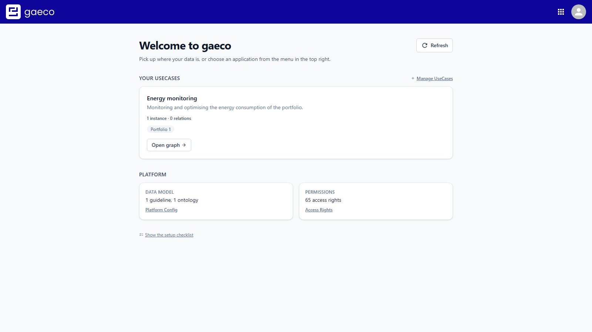
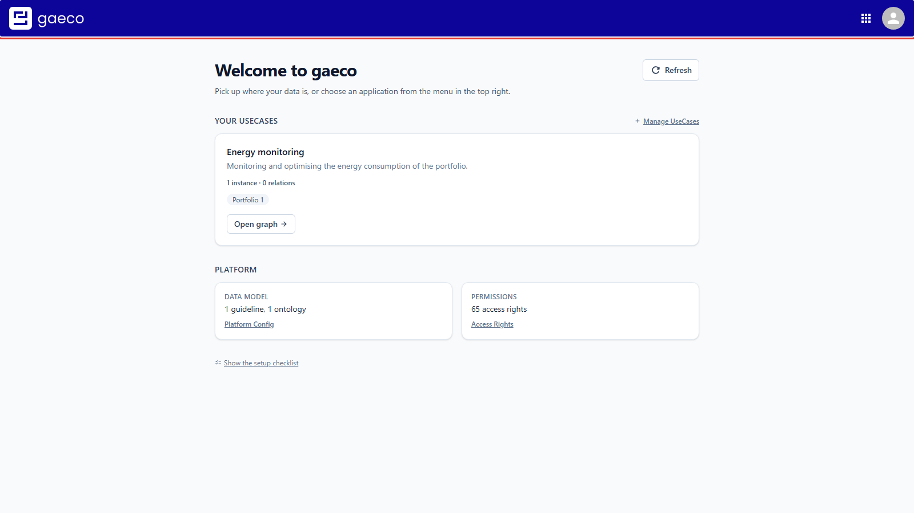
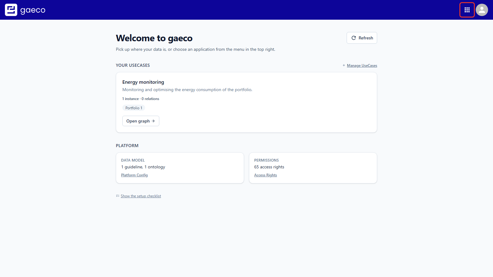
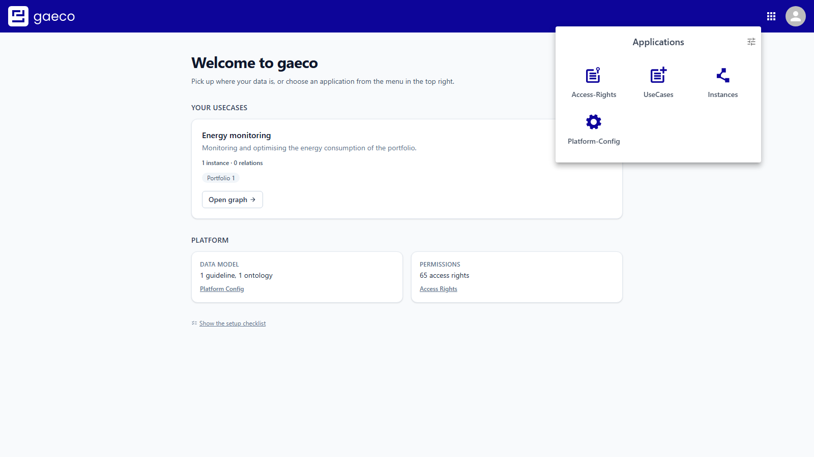
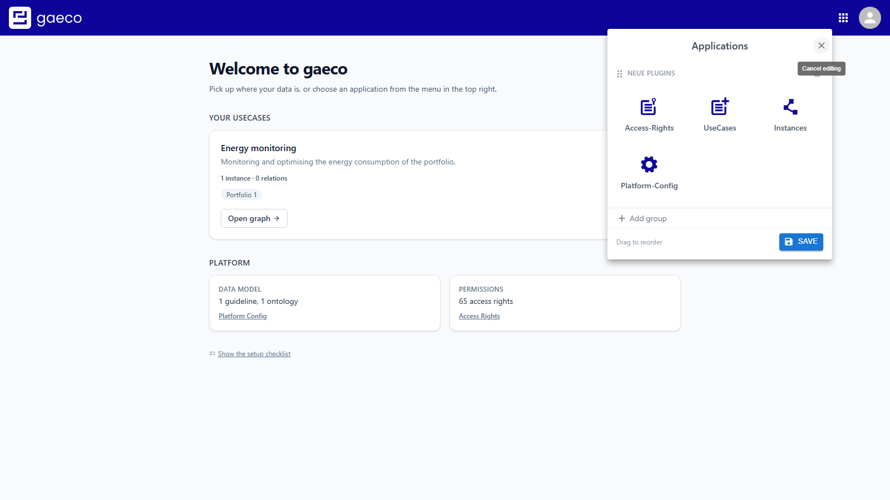
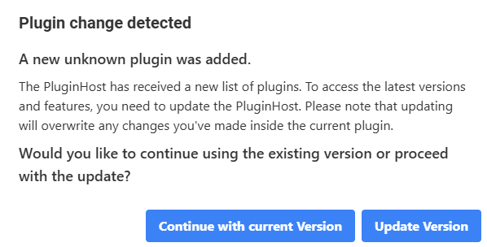

# Introduction

This document guides you through the Plugin Host: the shell that every gaeco module is loaded
into.

It deliberately offers little to interact with. The Plugin Host owns the login, the top bar and
the list of installed applications; everything below the top bar belongs to whichever module is
currently loaded. Knowing that boundary helps when something looks wrong — the top bar staying
while the content area fails is a module problem, not a shell problem.

# Prerequisites

- The `PluginHost Server` and `PluginHost Client` must be running.
- `Keycloak` and `MiniO` must be running.
- The `AppOrchestrator` must be running: it discovers the containerised module clients from their
  labels and registers them here. Without it the shell loads but the app launcher is empty.

# Signing In

Open <http://localhost:5000>. The application redirects to Keycloak, which asks for
credentials.

Sign in with an account from the configured realm. The realm that ships with the deployment
repository contains the user `admin` with the password `admin`, in the group `/Admin`.

After **Sign In** you are returned to the Plugin Host, which loads the home module.

# The Top Bar

The top bar is the only part of the page the shell itself draws. It stays constant while you move
between modules.

It holds three things: the logo, which returns you to the start page; the app launcher; and the
account menu.

# The App Launcher

The grid icon lists the installed applications.

Every module that the App Orchestrator has registered appears here. The active one is marked, and
only one module is loaded at a time.

If a module you expect is missing, the App Orchestrator is the place to look rather than the shell
— it is what reads the container labels and registers the microfrontends. See the
[App Orchestrator documentation](https://github.com/gaeco-ekkodale/AppOrchestrator).

## Reordering the Launcher

The entries can be rearranged to match how you work.

# The Account Menu

The avatar opens the account menu, which is also where you sign out. Click anywhere else to close
it.

# Plugin Updates

The Plugin Host watches for changes to the registered plugins and notices when a new version of
one becomes available. A warning symbol appears in the top bar when it does.

Clicking it opens a dialog describing the change and asking how to proceed.

## Kinds of Change

A plugin is *known* if the client has already received details about it, and *unknown* if it has
not and you are eligible to use it for the first time.

- **Plugin updated** — a known plugin moved to a new version. The dialog names the old and the new
  name and version, for example "A known plugin was updated from PluginName (v.1) to PluginName
  (v.2)".
- **Plugin added** — a new plugin became available, with its name and version, for example "A
  known plugin with Name 'NewPlugin' and Version 1 was added".
- **Plugin removed** — an existing plugin is no longer available, with the removed name and
  version.
- **Unknown plugin added** — a plugin whose details the client does not have. The message is the
  generic "A new unknown plugin was added".

## Your Options

- **Update version** — load the new version. **Any unsaved work in the current plugin is lost**,
  because the module is replaced.
- **Continue with current version** — keep what is loaded, and keep your progress. The prompt
  returns later.

The choice is worth taking seriously in the Instances module, where a graph can hold a good deal
of uncommitted editing.

# What to Do Next

The start page inside the shell reports what the platform still needs before it can take data. The
three setup steps in order, with screenshots of each, are in the user guide of the deployment
repository; the start page itself is documented with the Homepage module.

# Keycloak Client

The shell authenticates against `plugin-host-client`, the one browser-facing client in the shipped
realm. The modules do not perform a login of their own: they read the shell's token and check their
own entry under `resource_access`. That is why the realm defines a client per module even though only
the shell signs anybody in — and why all of them ship with it, with nothing to create.

# Developer Documentation

How plugins are registered, how the Module Federation remotes are resolved and how the update
detection works are described in the [developer documentation](../developer/01-Concepts.md).
